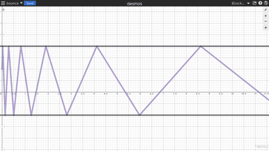

# Bouncer
Analytical solution to a bouncing ball written in Lua. Evaluate the position of a ball given initial conditions elasticity, lower wall, upper wall, position, and velocity.



## Implementation
```lua
local bouncer = require("bouncer")

local bouncer0 = bouncer.new({
	position = 1;
	velocity = 40;
	minimum = -1;
	maximum = 2;
	elasticity = 0.8;
})

onupdate(function(time_now)
	bouncer0:update(time_now)
end)
```
